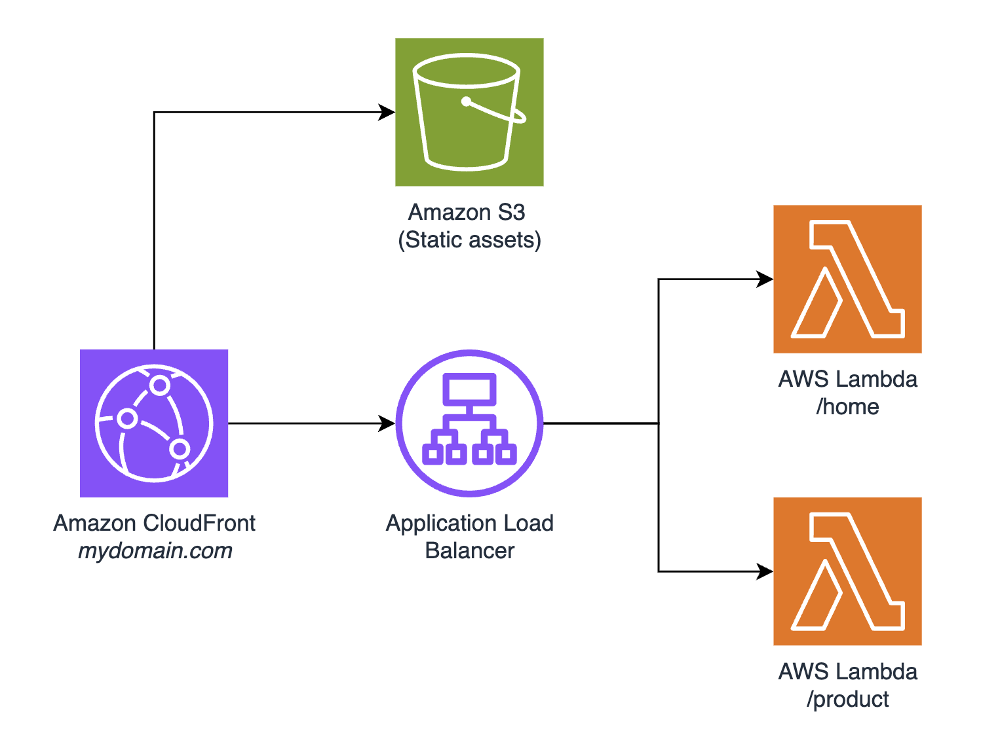

# Micro-frontends (MFE) on AWS pattern

## Architecture Diagram

The architecture that is deployed with this pattern is the following: 



## How does it work? 

Users connect to the Web Application through Amazon CloudFront in front of a Load Balancer. Depending on the path, (/home or /product), the load balancer will direct the user to the corresponding AWS Lambda functions. Each Lambda function is using the [Lambda Web Adapter](https://github.com/awslabs/aws-lambda-web-adapter/tree/main) to host NextJS applications. Each NextJS application corresponds to a micro-frontend. Static assests (such as CSS global styles) are served by the CDN through Amazon S3.

## Repository structure

```
├── homePage             --> Contains CDK code for the Lambda hosting the /home MFE
├── mfe-router           --> CDK code to deploy the CDN, S3 Bucket and Load Balancer
├── productPage          --> Contains CDK code for the Lambda hosting the /product MFE
├── shared               --> Contains shared components used by both MFEs
├── README.md

```

## Deploying the stacks

To make the best use of MFE, each teams needs to be the owner of their MFE. This is why this repository contains 3 stacks, one for each MFE and one for the overall structure that will serve the MFE to the user. This ensures that each MFE is loosly coupled with the rest of the application and can exists with minimal communication between each team.

Because of this, deploying the stack will require you to install node modules multiple times. In a production environment, each team will be in charge of their own modules and dependencies and this is what this pattern is trying to showcase.

### Prerequisites
* Node and NPM installed: https://docs.npmjs.com/downloading-and-installing-node-js-and-npm
* [AWS Cloud Development Kit](https://docs.aws.amazon.com/cdk/v2/guide/home.html) (AWS CDK) installed. This project uses the CDK in **TypeScript**
* [AWS CLI](https://docs.aws.amazon.com/cli/latest/userguide/install-cliv2.html) installed and configured

### Creating a log bucket for Amazon Cloudfront

Amazon CloudFront sends logs to S3 where you can view detailed information about every user request that CloudFront receives.

1. Using the [AWS Management Console](https://console.aws.amazon.com/s3/home) create a new S3 bucket and give it a relevant name. Make sure that ACLs are enabled and that the bucket is created in the correct region.
2. Inside the **mfe-router/** directory, create a file named **.env** and paste the following contents:
```
ACCESS_LOGS_BUCKET: "<replace-with-your-bucket-name>"
```
This file is used to set the bucket name as an environment variable for the CDK stack.

### Enabling flow logs (Optional)

In your **.env** file, paste the following:

```
ENABLE_FLOW_LOGS: "true"
ENABLE_ALB_LOGS: "true"
```

You can enable both by leaving both values to true. To enable only one, set the one you do not want to enable to false 

### Deploying the router

You will first start by deploying the mfe-router stack. This stack deploys a Amazon CloudFront distribution pointing to a Application Load Balancer and an Amazon S3 bucket for Static assets.

Navigate to the mfe-router directory:
```
cd mfe-router
```

Install the node modules
```
npm install
```

If this is your first time using the CDK for an account, you might need to bootstrap the environment
```
cdk bootstrap
```

Deploy the CDK stack:
```
cdk deploy
```

Navigate to the shared components folder and install the node modules
```
cd ../shared
npm install
```

After a few minutes, the stack should be deployed and you should be able to view and access the CloudFront domain URL. When accessing it, you should get **Default response from the ALB!** appear on your browser.

### Deploying the /home MFE

This section walk you through deploying the home MFE. This stack adds a rule to Load Balancer's listener to direct traffic to the Lambda function for /home requests.

From the project's root directory, navigate to the homePage's NextJS application:
```
cd homePage/app
```

Run the MakeFile to build the application and make it ready for deployment:
```
make build-mfe
```

Once this process is done, naviagte to the parent directory:
```
cd ..
```

Install the node modules
```
npm install
```

Deploy the CDK stack
```
cdk deploy
```

Once this is completed, naviagate to /home from your CloudFront URL and you be able to see your MFE application running!

### Deploying the /product MFE

This process is similar and to the previous stack and deploys the same resources for /product requests.

From the project's root directory, navigate to the productPage's NextJS application:
```
cd productPage/app
```

Run the MakeFile to build the application and make it ready for deployment:
```
make build-mfe
```

Once this process is done, naviagte to the parent directory:
```
cd ..
```

Install the node modules
```
npm install
```

Deploy the CDK stack
```
cdk deploy
```

Once this is completed, naviagate to /product from your CloudFront URL and you be able to see your MFE application running! You can click the button in the middle to switch between each MFE.

### Working with images

If you would like to have the CDN serve your images, you can copy the **/public** folder inside your static assets bucket and reference the image using:
```

```

## Deleteing resources

This project deploys AWS resources, hence they can start incurring costs if left idle. To remove the resources created when deploying the stacks, follow the following instructions.

In both MFE directories (homePage and productPage), run
```
cdk destroy
```

Navigate to the [S3 console](https://console.aws.amazon.com/s3/home) and empty the bucket containing **mfe-static-assets** in the name. Then, in the mfe-router directory, run
```
cdk destroy
```

## Security

See [CONTRIBUTING](CONTRIBUTING.md#security-issue-notifications) for more information.

## License

This library is licensed under the MIT-0 License. See the LICENSE file.
